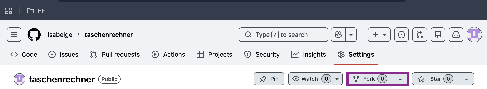
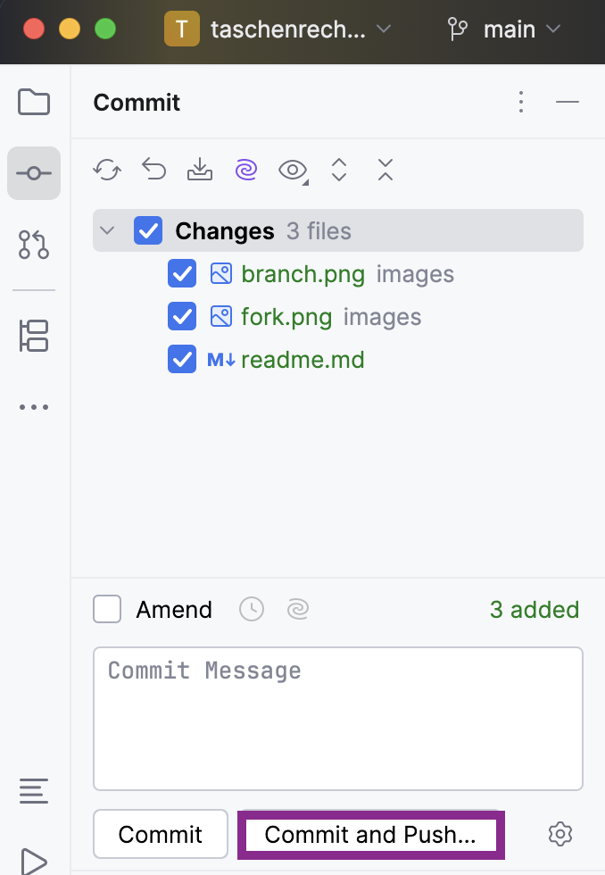

## Kollaboration mit Git & Github

Ziel dieser Aufgabe ist die Implementierung eines Taschenrechners im Team mit der Nutzung des GitHub-Workflows.

### Schritt 1 (NUR Administrator)

Ein Gruppenmitglied übernimmt die Rolle des Administrators und sezt das Projekt für die Gruppe auf.

1. Forke dieses Repository.
2. Lade die anderen Teammitglieder als Collaborators zu deinem neuen Repository ein.

  
Hilfestellung:

* Auf GitHub oben rechts auf den Knopf "Fork" drücken.

* Im neu geforkte Repository auf `Settings` -> `Collaborators` -> `Add people`

### Schritt 2 
Alle Gruppenmitglieder (inklusive des Administrators) klonen nun das Repository des Administrators (nicht das Original) in CLion.

1. Klone das Repository lokal in CLion.
2. Erstelle einen eigenen Branch für die Aufgabe: Jedes Gruppenmitglied implementiert einen Teil des Taschenrechners also zum Beispiel: Addition, Multiplikation etc.
3. Wechsle in diesen Branch.

  
Hilfestellung:

* Projekt in CLion klonen: `File` -> `New`-> `Project from Version Control` -> URL einfügen
* Auf main drücken, um einen neuen Branch hinzuzufügen.

* Achtet darauf, dass der Haken bei `Checkout branch` gesetzt ist.

### Schritt 3 
Jedes Gruppenmitglied implementiert die zugewiesene Funktion im Code:
* Gruppenmitglied 1: Addition
* Gruppenmitglied 1: Subtraktion
* Gruppenmitglied 1: Multiplikation
* Gruppenmitglied 1: Division

Testet euren Code lokal!

### Schritt 4 
Wenn eure Funktion korrekt implementiert ist:

1. Erstelle einen Commit mit einer aussagekräftigen Nachricht und pushe den Branch um diesen auf GitHub hochzuladen.

  
Hilfestellung:

 

### Schritt 5
Gehe nun auf die GitHub-Webseite von dem Repository.

1. Erstelle einen Pull Request von deinem Branch in den `main`-Branch.
2. Ein anderes Gruppenmitglied muss den Code nun reviewen (anschauen und kommentieren, falls etwas verbessert werden muss) und kommentieren oder freigeben.
3. Wenn alles passt kann der Pull Request gemerged werden.

  
Hilfestellung:

* GitHub zeigt nach dem Push ein gelbes Banner an `Compare & pull request`. Dies muss gedrückt werden.
* Unter dem Tab `Files changed` können Gruppenmitglieder den Code kommentieren.
* Erst wenn der Review positiv ist und nichts mehr verbessert werden muss, kann der Knopf `Merge pull request` gedrückt werden.

Merge-Konflikte:
Falls zwei Personen die gleiche Zeile geändert haben, kann der Merge-Konflikt in Clion mit dem `Merge-Tool` einfach gelöst werden.
Mit einem Mausklick kann entschieden werden, welche Code-Zeile behalten werden soll. 

### Schritt 6
Sobald alle 4 Pull Request gemerged wurden, ist das Projekt auf GitHub vollständig.
Damit alle den fertigen Code lokal haben müssen nun noch folgende Schritte durchgeführt werden:

1. Wechsle in CLion auf den Branch `main`.
2. Frühre einen Pull aus

  
Hilfestellung:

* Auf den aktuellen Branch klicken (Name des Branches, oben in der Leiste), dann `main` -> `Checkout`.
* Im Menupunkt `Git` kann der aktuellste Stand mit `pull` heruntergeladen werden. 

